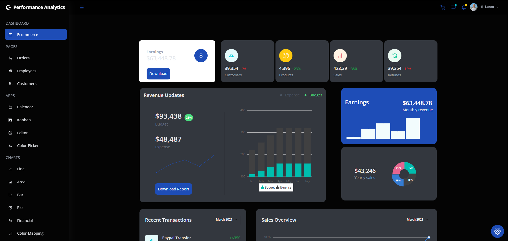

# A React Admin Dashboard App With Theming, Tables, Charts, Calendar and More


# 📊 Full Stack Dashboard Project

Welcome to the **Full Stack Dashboard** repository! This project is a complete dashboard with dark mode, custom components, and dynamic routes. Our goal is to provide an intuitive and visually appealing interface, with animation support to enhance the user experience.

## 🌟 Key Features

- **Dark Mode**: Interface with dark mode support for a comfortable experience in low-light environments.
- **Custom Components**: Multiple reusable and styled components to facilitate development.
- **Dynamic Routes**: Smooth and dynamic navigation between different parts of the dashboard.
- **Animations**: Transitions and animations to make interactions more engaging.
- **UserContext**: Global state management to facilitate data sharing between components.

## 🚀 Technologies Used

- **Frontend**:
  - React.js
  - Styled-components
  - React Router
  - Framer Motion (for animations)
  - UserContext (for global state management)
- **Backend** (under development):
  - Node.js
  - Express.js
  - MongoDB (or another database of your choice)


## 🛠️ Setup and Installation

### Prerequisites

- Node.js
├───backend (under development)
│   ├── MongoDB (or another database) 
- npm or yarn

### Installation Steps

1. **Clone the Repository**
   ```sh
   git clone https://github.com/Lucas-Pereira26/project_dashboard_full_stack.git
   cd project_dashboard_full_stack
   ```


3. **Install Frontend Dependencies**
   ```sh
   npm install
   ```

4. **Configure Environment Variables**
   Create a `.env` file in the root of the `backend` folder and set your environment variables as needed.


6. **Start the Frontend**
   ```sh

   npm start
   ```


## 📞 Contact

For questions or suggestions, feel free to open an issue or contact me directly:

- **Email**: Lukaaspereira349@gmail.com
- **LinkedIn**: [Lucas Pereira](https://www.linkedin.com/in/lucas-pereira-877a05252/)

---

I hope you enjoy using this project as much as I enjoyed creating it! 🚀

